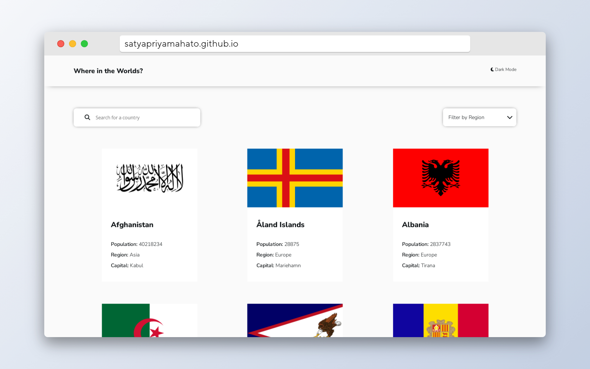
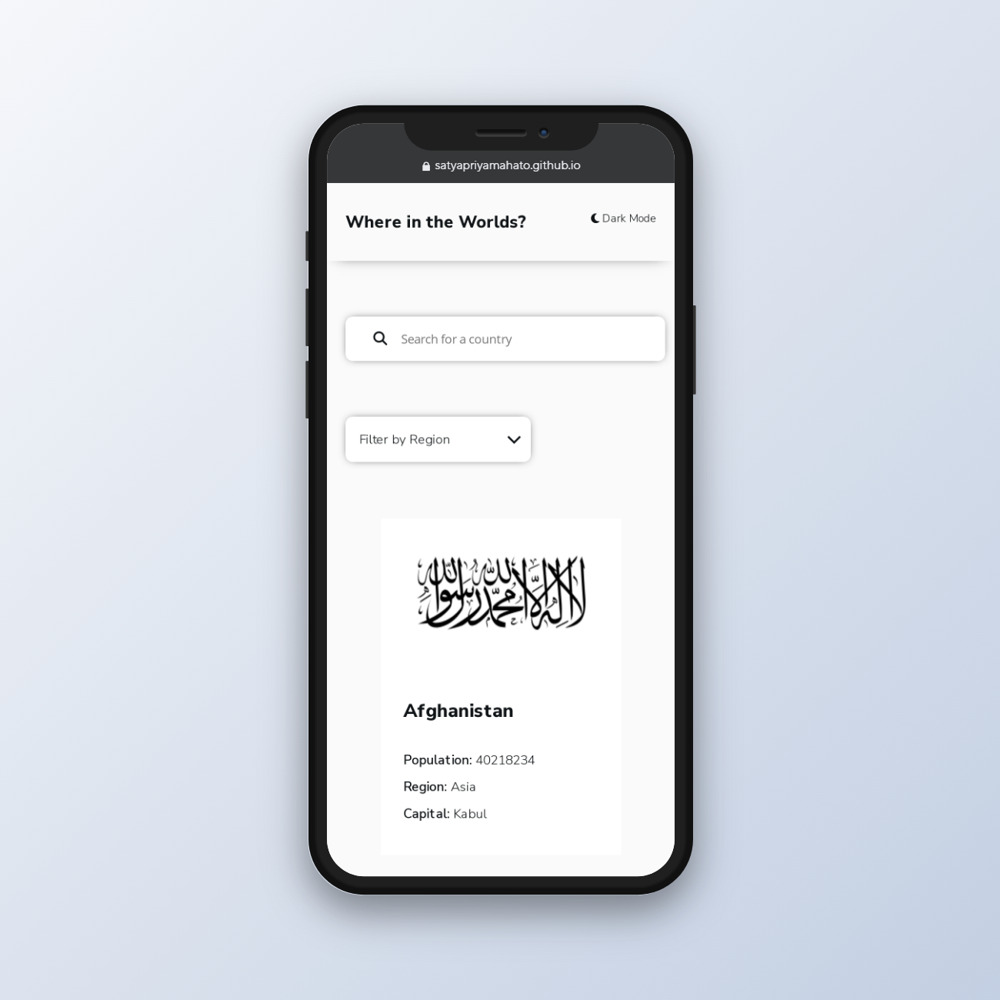

# Frontend Mentor - REST Countries API with color theme switcher solution

This is a solution to the [REST Countries API with color theme switcher challenge on Frontend Mentor](https://www.frontendmentor.io/challenges/rest-countries-api-with-color-theme-switcher-5cacc469fec04111f7b848ca). Frontend Mentor challenges help you improve your coding skills by building realistic projects.

## Table of contents

- [Overview](#overview)
  - [The challenge](#the-challenge)
  - [Screenshot](#screenshot)
  - [Links](#links)
- [My process](#my-process)
  - [Built with](#built-with)
  - [What I learned](#what-i-learned)
  - [Continued development](#continued-development)
  - [Useful resources](#useful-resources)
- [Author](#author)
- [Acknowledgments](#acknowledgments)

**Note: Delete this note and update the table of contents based on what sections you keep.**

## Overview

### The challenge

Users should be able to:

- See all countries from the API on the homepage
- Search for a country using an `input` field
- Filter countries by region
- Click on a country to see more detailed information on a separate page
- Click through to the border countries on the detail page
- Toggle the color scheme between light and dark mode _(optional)_

### Screenshot

### Links

- Solution URL: [Solution](https://github.com/SatyapriyaMahato/country-dictionary)
- Live Site URL: [Site](https://satyapriyamahato.github.io/country-dictionary/)

## My process

I started out with building the site by using html, css and vanilla javascript but i was not able to do the the filtering part and also the listing part was very repetitive. To tackle this problem i came to know about react and freshly building up the app.

### Built with

- Semantic HTML5 markup
- CSS custom properties
- Flexbox
- Mobile-first workflow
- React

### What I learned

I learned

- how to filter elements by catagory.
- how to filter by search query.
- how to traverse through nested objects and arrays.

### Continued development

I will exploring more on react and get a good grip on it.

### Useful resources

- [React](https://react.dev/) - This helped me to set up react on my local machine.

## Author

- Frontend Mentor - [@satyapriyamahato](https://www.frontendmentor.io/profile/satyapriyamahato)
- Twitter - [@satyapriya](https://www.twitter.com/satyapriyamahto)
